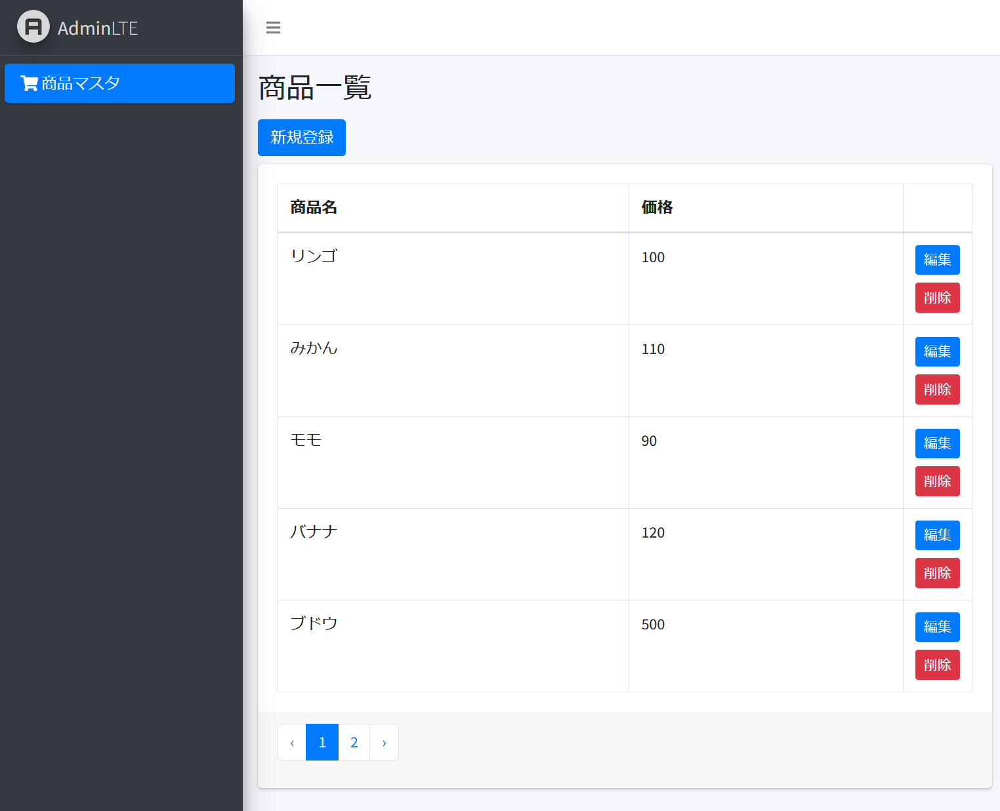

# Laravel 9 CRUD アプリケーション

## 概要

Laravel9 を使用した CRUD アプリケーションの実装。  
デザインは laravel-adminlte を使用。  
ページネーションにも対応。

## 書籍

本プロジェクトは、以下の「Laravel9 実践入門」の中で実装方法を解説しています。  
詳しくは以下のブログ記事をご覧ください。

https://chigusa-web.com/blog/kindle-laravel9/

## クローン

Sail を使用して環境を構築しています。  
プロジェクトをクローンして動作確認したい場合は、以下の記事をご覧ください。

https://chigusa-web.com/blog/laravel-github-clone/
